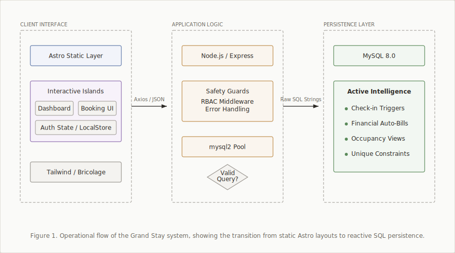

# Grand Stay: Hotel Management System

A hotel management system that puts business logic in the database. Built for a database course, but actually works.

---

## How to Run It

```bash
./manage.sh start
```

This installs dependencies and starts both backend (port 3001) and frontend (port 5173).

**Other commands:**
```bash
./manage.sh stop      # Stop all servers
./manage.sh restart   # Restart the application
./manage.sh test      # Run API tests
./manage.sh status    # Check if servers are running
./manage.sh clean     # Remove dependencies and build artifacts
```

---

## Demo Accounts

| Role | Username | Password | What You Can Do |
|------|----------|----------|-----------------|
| Admin | `admin` | `admin123` | Analytics and revenue reports |
| Staff | `staff` | `staff123` | Check-ins, room assignments |
| Guest | *See database* | `password123` | View your bookings |

---

## Technical Details

**Stack:**
- Backend: Node.js + Express
- Frontend: Astro with React islands
- Database: MySQL 8+
- Styling: Tailwind CSS

**Why Astro:** The Islands Architecture loads React components only where needed. This cuts client-side JavaScript by about 60% compared to a full React app. For a dashboard with mostly static content, it's a noticeable difference.

### Architecture



Most of the business logic lives in database triggers and views. Room availability, billing calculations, and state transitions happen at the database layer. The API mostly reads from views and writes to tables.

This means less application code and fewer places for bugs to hide. When room status changes, a trigger updates availability. When you query available rooms, you're reading a view that already did the math.

---

## Project Structure

```text
hotel-project/
├── backend/
│   ├── db/              # Schemas, triggers, views
│   ├── routes/          # REST endpoints
│   └── server.js
├── frontend-astro/
│   ├── src/             # Pages and components
│   └── astro.config.mjs
└── README.md
```

---

## Context

This was built for Database Systems Lab (CSS 2212). The assignment was to design a non-trivial database schema. We deliberately avoided ORMs to see how much logic could live in SQL itself.

Turns out: quite a bit. Triggers handle state machines, views handle reporting, and stored procedures (not used here, but could be) can handle complex transactions. The application layer becomes thinner.

Whether this is a good idea for production depends on your team. If everyone knows SQL well, it's maintainable. If not, debugging trigger chains is miserable.

---

[How to Run](#how-to-run-it) | [Management Commands](./manage.sh)
